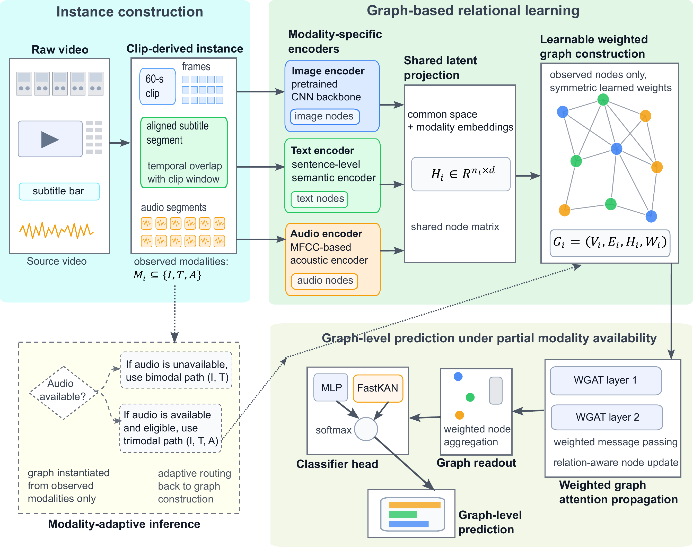
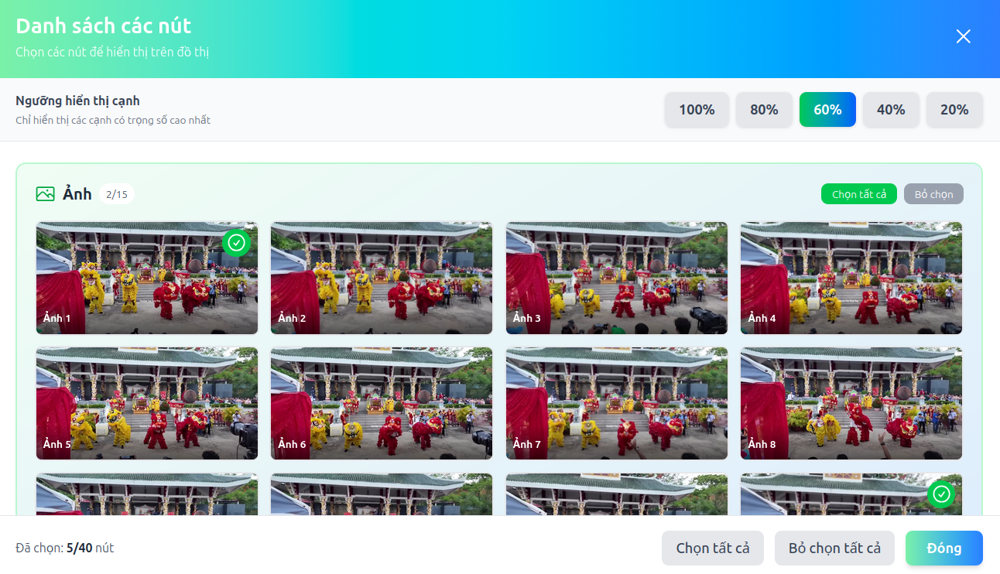
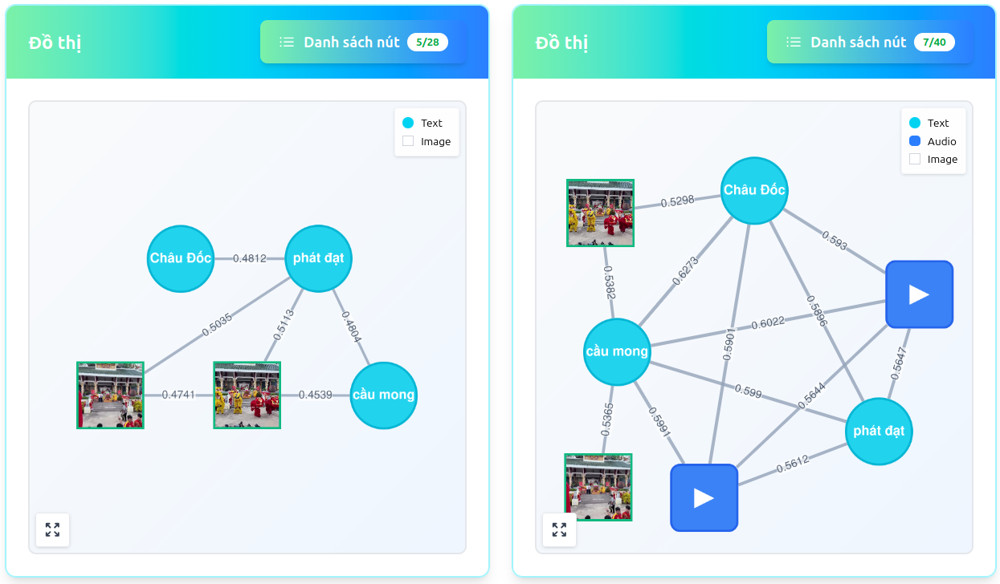

# MAMIG

## Modality-Adaptive Multimodal Instance-Graph Learning for Intangible Cultural Heritage Classification

**MAMIG** is a research framework for clip-level intangible cultural heritage (ICH) classification under partial modality availability. Each clip-derived instance is represented as a multimodal graph built only from the image, text, and audio elements that are actually observed for that instance.

This repository accompanies the manuscript **“Modality-Adaptive Multimodal Instance-Graph Learning for Intangible Cultural Heritage Classification”** by **Huu-Hoa Nguyen, Hai-Nhan Tran, and Thanh Ma**.

  

<em>MAMIG constructs an instance-specific graph from observed multimodal elements, learns weighted relations among them, and performs graph-level prediction.</em>

> **Methodological focus.** The central contribution is the modality-adaptive instance-graph formulation, including observed-modality graph construction, learned relation weighting, weighted graph-attention propagation, and structure-aware graph-level prediction. FastKAN is evaluated as an alternative prediction head against a standard MLP. It is not a required component of MAMIG.

## What MAMIG does

- Builds each graph from the modalities actually observed for the current clip, without synthetic placeholder nodes or modality reconstruction.
- Represents sampled frames, subtitle units, and eligible audio segments as heterogeneous graph nodes.
- Learns instance-specific relation weights and uses them during graph-attention propagation and graph readout.
- Evaluates bimodal `(I, T)` and trimodal `(I, T, A)` regimes separately while preserving observed-modality inference within each regime.
- Uses a grouped source-video split to reduce leakage from closely related clips originating from the same raw video.
- Includes a controlled missing-modality stress test that separates robustness to missing inputs from the naturally uneven modality profile of the corpus.

## Dataset and evaluation setting

The benchmark contains **2,400 clip-derived Vietnamese ICH instances** from **300 source videos** across **8 categories**. Each target clip is 60 seconds long, with 15 sampled image frames and up to 12 five-second audio segments when audio is eligible. Text is available for 1,788 instances (74.5%), and audio is eligible for 1,410 instances (58.8%).

The eight categories are Cai Rang Floating Market, Bay Nui Ox Racing Festival, Nghinh Ong Festival, Hoi Lim Festival, Bamboo Weaving, Mat Weaving, Ok Om Bok Festival, and Ba Chua Xu Festival at Nui Sam.

The realized modality profile is heterogeneous: 284 instances contain image only, 706 contain image and text, 328 contain image and audio, and 1,082 contain image, text, and audio.

### Source-disjoint partition

All clips extracted from the same raw source video are assigned to the same split. The final partition contains **1,680 / 360 / 360 instances** from **210 / 43 / 47 source videos** for training, validation, and testing, respectively. The 47 test source videos are absent from both training and validation.

This protocol provides **within-corpus cross-source evidence**. It does not establish cross-dataset or cross-cultural transfer.

### Subtitle preprocessing

Subtitle preprocessing is primarily deterministic. Limited LLM assistance is used only for borderline normalization under predefined criteria, followed by manual spot checking. The external generative system is not used to assign labels, define categories, determine split membership, or generate model predictions. Cleaned text is finalized before model training.

## Method

MAMIG processes each clip-derived instance in five stages:

1. **Modality-specific encoding.** Image features are extracted with an ImageNet-pretrained CNN backbone, text is encoded with a frozen multilingual sentence encoder, and each eligible five-second audio segment is represented by a 39-dimensional MFCC descriptor composed of 13 MFCC coefficients, delta features, and delta-delta features followed by temporal mean pooling.
2. **Shared latent projection.** Modality-specific features are projected into a common 512-dimensional latent space and augmented with modality embeddings.
3. **Learnable graph construction.** Each observed element becomes a node, and a symmetric nonnegative weighted adjacency matrix is learned from the projected node representations.
4. **Weighted graph-attention propagation.** Learned relation strength modulates message passing across observed nodes.
5. **Graph-level prediction.** A structure-aware weighted readout produces the graph representation, which is classified by either an MLP or a FastKAN head.

The MLP and FastKAN variants use the same graph construction, propagation, and readout. This isolates the effect of the final prediction head.

## Key results

The strongest configuration is **DenseNet + Graph-FastKAN** under the trimodal setting.

| Method | Setting | Accuracy | Macro F1 |
| --- | --- | ---: | ---: |
| MobileNet-L + Frame-CNN | Image | 0.9028 | 0.9006 |
| DenseNet + AttnFusion | Image + text + audio | 0.9251 | 0.9248 |
| DenseNet + Graph-MLP | Image + text + audio | 0.9417 | 0.9413 |
| **DenseNet + Graph-FastKAN** | **Image + text + audio** | **0.9435** | **0.9438** |

The best configuration improves Macro F1 by **4.32 percentage points** over the strongest image-only baseline and by **1.90 percentage points** over the strongest non-graph multimodal baseline. For these two primary comparisons, the manuscript reports exact two-sided Wilcoxon p-values of **0.0020** and Holm-adjusted p-values of **0.0039**.

The ablation results also clarify where the gain comes from. Replacing FastKAN with MLP changes Macro F1 from 0.9438 to 0.9413, a difference of 0.25 percentage points. Removing learnable edge weighting lowers Macro F1 to 0.9340, a decrease of 0.98 percentage points. FastKAN is therefore treated as a modest, configuration-dependent head-level refinement rather than the primary source of MAMIG's performance gain.

## Controlled missing-modality robustness

A controlled stress test starts from the **160 test instances with all three modalities observed**. Image is always retained, while complete text and audio node sets are removed at controlled rates. The same trimodal checkpoints are used without retraining for individual missing rates.

| Missing rate | Induced profile: I / I+T / I+A / I+T+A | Macro F1 |
| ---: | --- | ---: |
| 0% | 0 / 0 / 0 / 160 | 0.9631 ± 0.0031 |
| 25% | 10 / 30 / 30 / 90 | 0.9564 ± 0.0035 |
| 50% | 40 / 40 / 40 / 40 | 0.9448 ± 0.0041 |
| 75% | 90 / 30 / 30 / 10 | 0.9289 ± 0.0048 |
| 100% | 160 / 0 / 0 / 0 | 0.9076 ± 0.0054 |

At 50% missing, the four induced modality patterns are exactly balanced at 40 instances each. The 0% result is evaluated only on the 160 fully observed instances and is not directly comparable with the main 360-instance benchmark. At 100% missing, the same trimodal checkpoints operate on image nodes only. This condition is not the separately trained Frame-CNN image-only baseline.

## Qualitative graph inspection

The repository includes a web interface for examining observed nodes and learned graph structure at the instance level.

  

  

  <em>The interface supports node-level inspection and visualization of modality-specific graph structure and displayed edge weights.</em>

## Experimental settings at a glance

The main benchmark uses a 512-dimensional shared latent space, two graph-attention layers, four attention heads, node dropout of 0.20, AdamW with an initial learning rate of `1e-4`, weight decay of `1e-5`, an effective batch size of 16, validation-based checkpoint selection, and up to 100 training epochs.

Each method in the main benchmark is evaluated over 10 fixed random seeds: `42, 123, 314, 512, 1023, 2025, 3407, 4096, 8191, 10007`. Ten-run mean Macro F1 is used for ranking. Statistical tests therefore assess seed-level stability on the fixed source-disjoint partition, not uncertainty over alternative dataset partitions.

## Responsible reuse

The project concerns research artifacts derived from publicly accessible online cultural media. Users should respect the use conditions distributed with any released data and any rights associated with the original source material. This repository should not be interpreted as granting rights to third-party content beyond the materials and permissions explicitly provided with the release.

## Contact

**Corresponding author:** Thanh Ma, College of Information and Communication Technology, Can Tho University, `mtthanh@ctu.edu.vn`  
